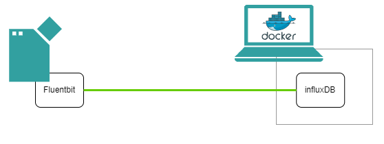

# Edge Device Logging & Monitoring

## Table of Contents

- [Edge Device Logging \& Monitoring](#edge-device-logging--monitoring)
  - [Table of Contents](#table-of-contents)
  - [Description](#description)
    - [Overview](#overview)
    - [General task](#general-task)
  - [Requirements](#requirements)
    - [Prerequisites](#prerequisites)
    - [Used components](#used-components)
  - [Installation steps](#installation-steps)
  - [Documentation](#documentation)
  - [Contribution](#contribution)
  - [License and Legal Information](#license-and-legal-information)
  - [Disclaimer](#disclaimer)

## Description

### Overview

This application example demonstrates functionality of the Edge devices metrics agent which allows you to collect IED metrics and send them to some external service.  The provided Logging & Monitoring service is based on [fluentbit](https://fluentbit.io/) technology. More information about this can be found [here](https://cache.industry.siemens.com/dl/dl-media/766/109811766/att_1107397/v1/ied_operation_en-US/en-US/index.html).

### General task

This application example aims for the usage of Industrial Edge Device's Logging & Monitoring service to collect metrics using the internal fluentbit service and sending them to an external database based on influxDB.  
Afterwards those metrics can be visualized using tools like Grafana, etc. **In this example we will visualize data with the built-in web UI of InfluxDB.**  
The infrastructure and different tools are shown in the picture below. 

## Requirements

### Prerequisites

- onboarded Industrial Edge device
- Linux VM with docker and docker-compose installed

### Used components

- Industrial Edge Virtual Device v1.24.1-1-a
- Ubuntu VM 22.04 LTS
- Docker v28.3.3
- Docker Compose v2.39.1 

## Installation steps

To successfully run this application you need to follow three steps:

1. [Set up InfluxDB](docs/Installation.md#set-up-influxdb-database)
2. [Enable Logging & Monitoring service](docs/Installation.md#enable-logging-and-monitoring-service)
3. [Create InfluxDB dashboard](docs/Installation.md#create-influxdb-dashboard)

Detailed description of the installation steps can be found [here](docs/Installation.md).

## Documentation

You can find further documentation and help in the following links:

- [Industrial Edge Documentation](https://docs.industrial-operations-x.siemens.cloud/)
- [Industrial Edge SIOS Forum](https://www.siemens.com/industrial-edge-forum)
- [Industrial Edge Mendix Forum](https://forum.mendix.com/link/space/industrial-edge)
- [Industrial Edge landing page](https://new.siemens.com/global/en/products/automation/topic-areas/industrial-edge/simatic-edge.html)

## Contribution

Thank you for your interest in contributing. Anybody is free to report bugs, unclear documentation, and other problems regarding this repository in the Issues section.
Additionally everybody is free to propose any changes to this repository using Pull Requests.

If you haven't previously signed the [Siemens Contributor License Agreement](https://cla-assistant.io/industrial-edge/) (CLA), the system will automatically prompt you to do so when you submit your Pull Request. This can be conveniently done through the CLA Assistant's online platform. Once the CLA is signed, your Pull Request will automatically be cleared and made ready for merging if all other test stages succeed.

## License and Legal Information

Please read the [Legal information](LICENSE.md).

## Disclaimer

IMPORTANT - PLEASE READ CAREFULLY:

This documentation describes how you can download and set up containers which consist of or contain third-party software. By following this documentation you agree that using such third-party software is done at your own discretion and risk. No advice or information, whether oral or written, obtained by you from us or from this documentation shall create any warranty for the third-party software. Additionally, by following these descriptions or using the contents of this documentation, you agree that you are responsible for complying with all third party licenses applicable to such third-party software. All product names, logos, and brands are property of their respective owners. All third-party company, product and service names used in this documentation are for identification purposes only. Use of these names, logos, and brands does not imply endorsement.
