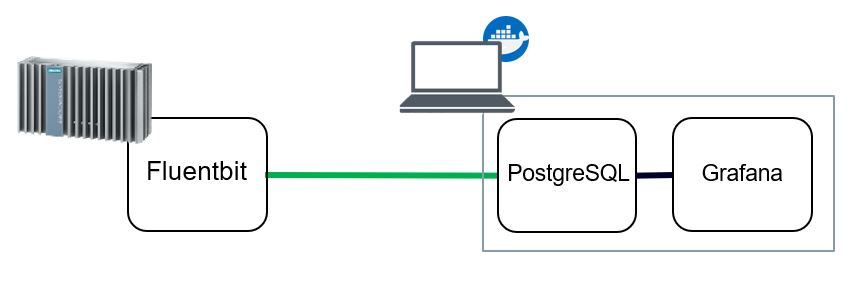

# Edge Device Logging & Monitoring

## Table of Contents

- [Edge Device Logging & Monitoring](#edge-device-logging--monitoring)
  - [Table of Contents](#table-of-contents)
  - [Description](#description)
    - [Overview](#overview)
    - [General task](#general-task)
  - [Requirements](#requirements)
    - [Prerequisites](#prerequisites)
    - [Used components](#used-components)
  - [Installation steps](#installation-steps)
  - [Documentation](#documentation)
  - [Contribution](#contribution)
  - [License and Legal Information](#license-and-legal-information)
  - [Disclaimer](#disclaimer)

## Description

### Overview

This application example demonstrates functionality of the Edge devices metrics agent which allows to collect IED metrics and send them to some external service. The provided Logging and Monitoring service is based on [fluentbit](https://fluentbit.io/) technology. More information about this can be found [here](https://cache.industry.siemens.com/dl/dl-media/766/109811766/att_1107397/v1/ied_operation_en-US/en-US/index.html).

### General task

The goal of this application example is to show how to use the Edge device's Logging and Monitring service to collect metrics using fluentbit and send them to external database based on Postgres. Postgres can then be connected with different visualization tools like Grafana over the available plugin to visualize historical metrics data. The infrastructure and different tools are shown in the picture below. 

> **_NOTE:_**  Implementation and configuration of Grafana is not part of this documentation. For visualization of the metrics data, you can use different visualization tools.  

## Requirements

### Prerequisites

- Activated Edge device 
- Linux VM with docker and docker-compose installed

### Used components

- Industrial Edge Device V 1.11.0-4-a
- VM Ubuntu 20.04
- Docker 19.03.13

## Installation steps

To successfully run this application you need to follow three steps:

1. [Set up Postgres and Grafana](docs/Installation.md#set-up-influxdb-and-grafana)
2. [Create and upload metrics agent configuration file](docs/Installation.md#build-and-deploy-the-application)
3. [Create a dashboard in Grafana](docs/Installation.md#create-a-dashboard-in-grafana)

Detailed description of the installation steps can be found [here](docs/Installation.md).

## Documentation

You can find further documentation and help in the following links:

- [Industrial Edge Hub](https://iehub.eu1.edge.siemens.cloud/#/documentation)
- [Industrial Edge Forum](https://www.siemens.com/industrial-edge-forum)
- [Industrial Edge landing page](https://new.siemens.com/global/en/products/automation/topic-areas/industrial-edge/simatic-edge.html)
- [Industrial Edge App Developer Documentation](https://industrial-edge.io/developer/index.html)

## Contribution

Thank you for your interest in contributing. Anybody is free to report bugs, unclear documentation, and other problems regarding this repository in the Issues section.
Additionally everybody is free to propose any changes to this repository using Pull Requests.

If you haven't previously signed the [Siemens Contributor License Agreement](https://cla-assistant.io/industrial-edge/) (CLA), the system will automatically prompt you to do so when you submit your Pull Request. This can be conveniently done through the CLA Assistant's online platform. Once the CLA is signed, your Pull Request will automatically be cleared and made ready for merging if all other test stages succeed.

## License and Legal Information

Please read the [Legal information](LICENSE.md).

## Disclaimer

IMPORTANT - PLEASE READ CAREFULLY:

This documentation describes how you can download and set up containers which consist of or contain third-party software. By following this documentation you agree that using such third-party software is done at your own discretion and risk. No advice or information, whether oral or written, obtained by you from us or from this documentation shall create any warranty for the third-party software. Additionally, by following these descriptions or using the contents of this documentation, you agree that you are responsible for complying with all third party licenses applicable to such third-party software. All product names, logos, and brands are property of their respective owners. All third-party company, product and service names used in this documentation are for identification purposes only. Use of these names, logos, and brands does not imply endorsement.
