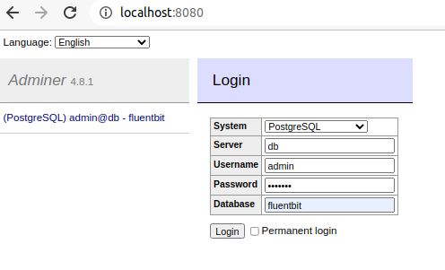
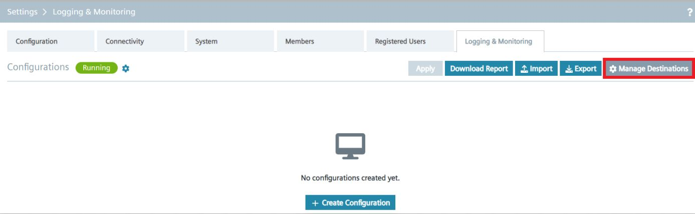
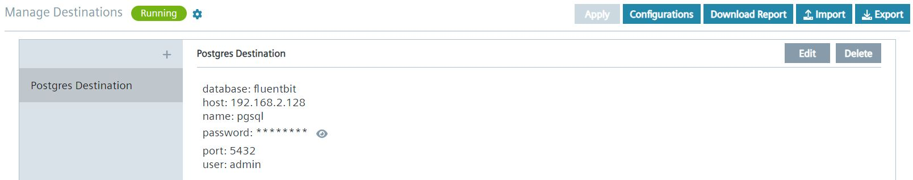
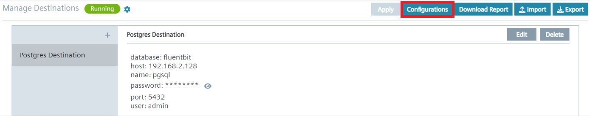
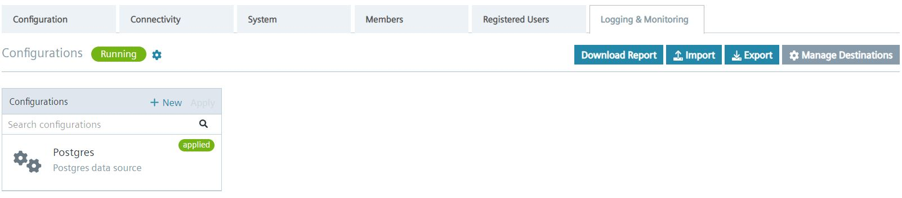
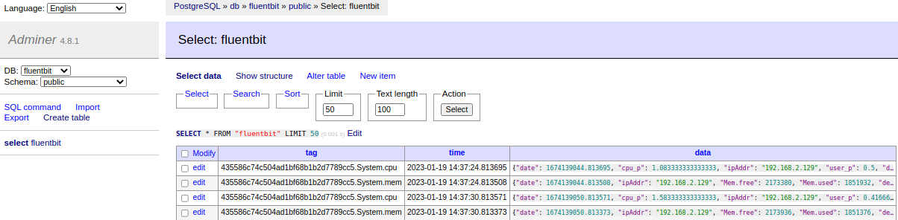
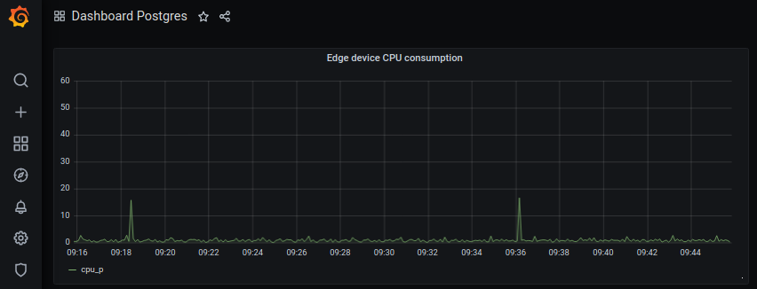

# Edge Device Logging & Monitoring

- [Edge Device Logging & Monitoring](#edge-device-logging--monitoring)
  - [Installation steps](#installation-steps)
    - [Set up Postgres database](#set-up-postgres-database)
    - [Enable Logging and Monitoring service](#enable-logging-and-monitoring-service)
    - [Visualization](#visualization)

## Installation steps

### Set up Postgres database

To set up the Postgres database , follow the instructions below. 

1. Clone this respository to you local environment with docker installed. 
2. Open the [src](../src) folder in the terminal
3. Rename the yaml file to `docker-compose` and adjust the `docker-compose` file with the following information: 
  ```
  - POSTGRES_PASSWORD
  - POSTGRES_USER
  - POSTGRES_DB
  ```
4. Run the following command

```bash
  docker-compose up
```
5. To access and manage your database, you can use the adminer by accessing `http://localhost:8080` in your browser.




### Enable Logging and Monitoring service

1. Go to the IED user interface -> "Settings" -> "Logging & Monitoring".
2. Click on "Manage Destinations".



3. Click "Create Destinations"
4. On the left hand side select "pgsql" option under "select destination type".
5. Fill in the form with the database details. 
6. Click "Save".
7. Your destination is created.
   

   
8. Click on "Configurations".



9. Press "Create COnfiguration".
10. A Wizard opens up. Fill in the required information for the "Data source" select which information you want to send out. 
    
> **_NOTE:_**  You have the option to send metrics from all edge apps or a system metrics like cpu or memory consumption of the edge device. 

11. Click on "2. Metrics" and select which metrics you want to send to the database. 
12. Click on "3. Data destination" and select the destionation you have created.
13. Press "Submit". The configuration is now ready to apply.
14. If needed, you can change settings by clicking on a toothed wheel. 
15. Click on "Apply" under _Configurations


16. Click on "Save and apply". 
17. Go back to "Configurations" and you should see that your configuration of the Logging and Monitoring service is applied.
    


18. You can then see and explore the data coming in the database using the adminer. 



**To understand what individual components of the CPU and other metrics mean, please refer to this page [here](https://www.opsdash.com/blog/cpu-usage-linux.html) and [here](https://docs.fluentbit.io/manual/pipeline/inputs/cpu-metrics)**

### Visualization

When having the data in the database, we are now able to visualize the data. For that you can use different visualization tool like Datadog, Metabase or Grafana. 

Using Grafana, the dashboard to visualize Edge device CPU consumtion over time could look like this.



> **_NOTE:_**  This feature can be leverage to monitor metrics from different devices. If you have multiple edge devices with Logging and Monitoring feature enabled, you can then set up multiple database instances to collect the metrics.