# Edge Device Logging & Monitoring

- [Edge Device Logging \& Monitoring](#edge-device-logging--monitoring)
  - [Installation steps](#installation-steps)
    - [Set up InfluxDB database](#set-up-influxdb-database)
    - [Enable Logging and Monitoring service](#enable-logging-and-monitoring-service)
    - [Create InfluxDB dashboard](#create-influxdb-dashboard)

## Installation steps

### Set up InfluxDB database

To set up the Influx database, follow the instructions below. 

1. Clone this repository to you local environment. Docker and docker-compose plugin needs to be installed. 
2. Open the [src](../src) folder in the terminal.
3. Rename the YAML file to `docker-compose.yml` and update the following environment variables. These will be needed for configuring Logging & Monitoring service later on: 
  ```
  - DOCKER_INFLUXDB_INIT_USERNAME
  - DOCKER_INFLUXDB_INIT_PASSWORD
  - DOCKER_INFLUXDB_INIT_ORG
  - DOCKER_INFLUXDB_INIT_BUCKET
  - DOCKER_INFLUXDB_INIT_ADMIN_TOKEN
  - DOCKER_INFLUXDB_INIT_RETENTION
  ```
4. Run the following command

```bash
  docker compose up -d
```
5. To access and manage your database, you can use InfluxDB UI by accessing `http://localhost:8086` in your browser:

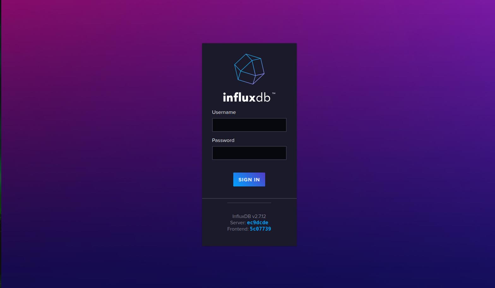


### Enable Logging and Monitoring service

1. Navigate to IEVD's user interface -> "Settings" -> "Logging & Monitoring".
   
2. Click on the "3 dots" in the upper right corner. Then select "Destinations Management":

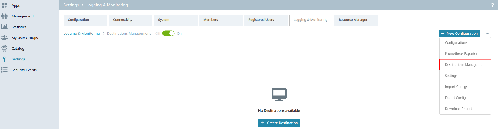

3. Click "Create Destination"
4. On the left side select "InfluxDB" option under "type to search destination".
5. Fill in the form with the database details:
   - destination name:  e.g. `InfluxDB`
   - host: IP of host where InfluxDB is running e.g. `192.168.0.10`
   - port: port specified in `docker-compose.yml`
   - bucket: bucket specified in `docker-compose.yml`
   - org: organization specified in `docker-compose.yml`
   - http_token: token specified in `docker-compose.yml`
6. Click "Save".
7. Your destination is created:
   
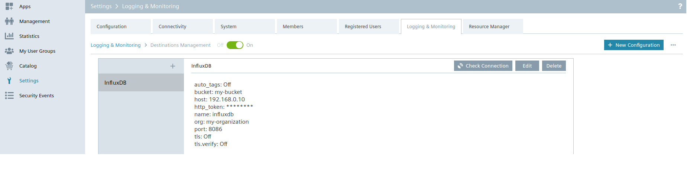
   
8. Click on "New Configuration". A Wizard opens up:

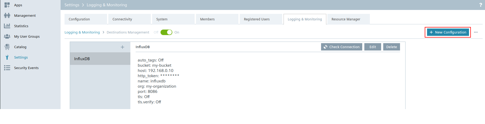


    
> **_NOTE:_**  In the following we will configure the Data Source and Metrics which you want to export. <br>
> You have the option to send metrics from the system  or some specific app which is installed on the Edge Device. <br>
> If you choose `system` you can select e.g. cpu, ram and docker as metrics in the next step. Afterwards CPU and RAM of the host system (Edge Device) will be exported. Docker metrics will also export all data from each app installed on the Edge Device. <br>
> If you select a specific app, you might get additional metrics of this app compared to when only selecting `system` --> `docker`. <br>
> In this example we will use `system` --> `cpu`, `ram` and `docker`, see:

9. Fill in the required information for "1. Data source". Select which information you want to export:

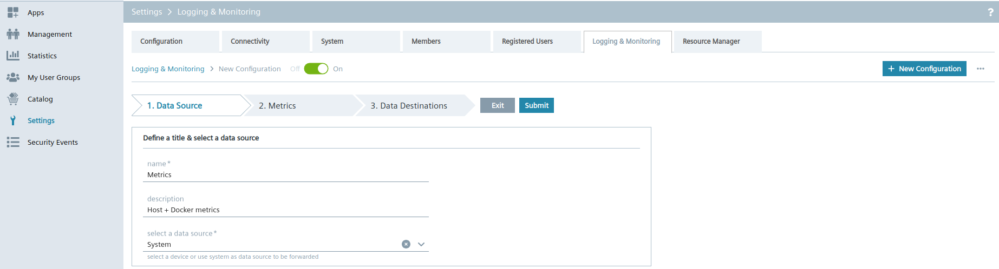
10. Click on "2. Metrics" and select which metrics you want to send to the database:

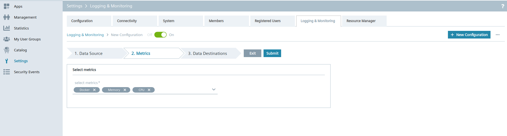

11. Click on "3. Data Destinations" and select the destination you have created previously:
  
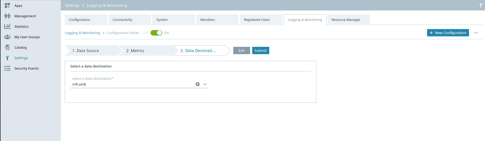

12. Press "Submit" Button.
13. The green light will indicate a healthy connection to your database. If it is red, you need to check the filled information for your destination:
    
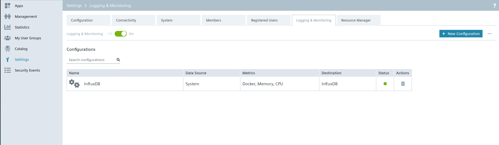

14. **Optional:** fine tune settings of Logging & Monitoring service. Click on the "3 dots" in the upper right corner and go to "Settings":

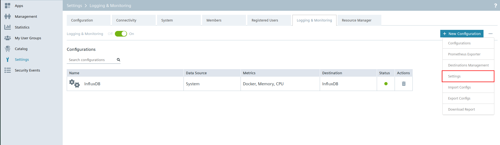

15. - Flush: Interval how often metrics will be pushed to your destination
    - Polling interval: Interval how often metrics will be collected. Lower values depend on performance of Edge Device. More powerful CPU + more RAM will result in a lower value which can be selected. In this case every 1s metrics will be collected, see:
    
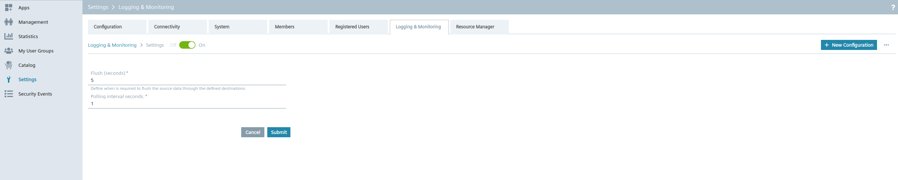


**To understand what individual components of the CPU and other metrics mean, please refer to this page [here](https://www.opsdash.com/blog/cpu-usage-linux.html) and [here](https://docs.fluentbit.io/manual/pipeline/inputs/cpu-metrics)**

### Create InfluxDB dashboard

When having the data in the database, we are now able to visualize the data. For that you can use different visualization tools like Grafana for example. <br>
In this case we create a simple dashboard directly in InfluxDB UI:

1. Access your database. Use InfluxDB UI by accessing `http://localhost:8086` in your browser:


2.  After logging in, go to Dashboards tab:

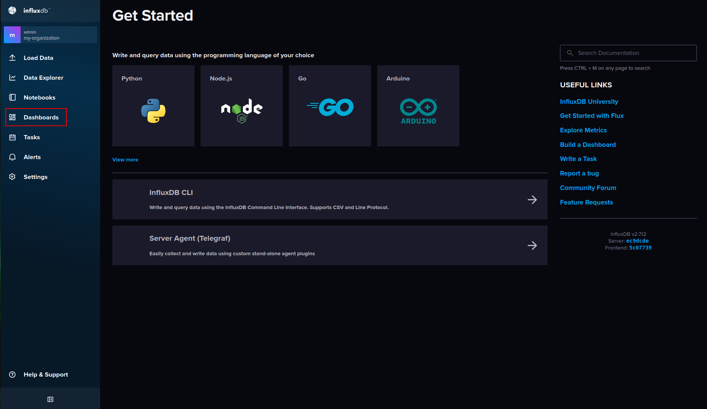

3. Click "+ Create Dashboard" --> "Import Dashboard" and select `metrics_industrial_edge.json` which can be found in [src](../src) folder.
4. Now you should see:

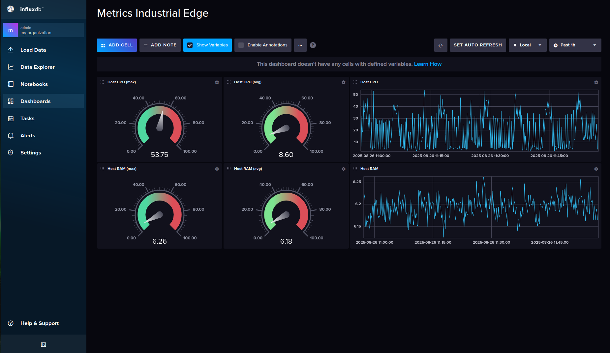.

> **_NOTE:_**  This dashboard provides you with a good entry point to customize a dashboard fulfilling your own needs. <br>
> Currently it only visualizes `System.cpu` and `System.mem` metrics. If you want to extend this dashboard with additional widgets to display Industrial Edge applications' consumption you would need to visualize `System.docker` metrics. Those metrics could be explored when switching to 'Data Explorer' tab.